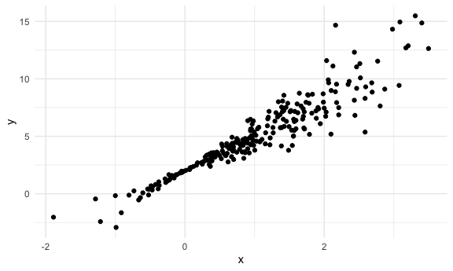
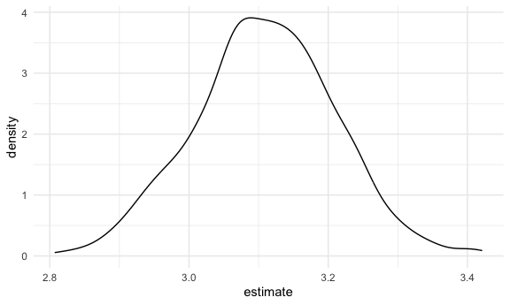

bootstrapping
================
ASHLEY ROMO
2023-11-26

Load key packages.

``` r
library(tidyverse)
library(modelr)

set.seed(1)
```

## Generate a relevant sample

``` r
n_samp = 250

#every residual is drawn from a normal distribution with mean 0 and sd 1
sim_df_const = 
  tibble(
    x = rnorm(n_samp, 1, 1),
    error = rnorm(n_samp, 0, 1),
    y = 2 + 3 * x + error
  )

# every residual depends on x (x values close to zero will have smaller errors and x values close to one will have larger errors)
sim_df_nonconst = 
  sim_df_const |> 
  mutate(
    error = error * 0.75 * x, 
    y = 2 + 3 * x + error
  )

sim_df_const |> 
  ggplot(aes(x = x, y = y)) + 
  geom_point()
```


``` r
sim_df_nonconst |> 
  ggplot(aes(x = x, y = y)) +
  geom_point()
```



fit some linear models

``` r
sim_df_const |> 
  lm(y ~ x, data = _) |> 
  broom::tidy()
```

    ## # A tibble: 2 × 5
    ##   term        estimate std.error statistic   p.value
    ##   <chr>          <dbl>     <dbl>     <dbl>     <dbl>
    ## 1 (Intercept)     1.98    0.0981      20.2 3.65e- 54
    ## 2 x               3.04    0.0699      43.5 3.84e-118

``` r
sim_df_nonconst |> 
  lm(y ~ x, data = _) |> 
  broom::tidy() 
```

    ## # A tibble: 2 × 5
    ##   term        estimate std.error statistic   p.value
    ##   <chr>          <dbl>     <dbl>     <dbl>     <dbl>
    ## 1 (Intercept)     1.93    0.105       18.5 1.88e- 48
    ## 2 x               3.11    0.0747      41.7 5.76e-114

``` r
# lm assumes the assumptions of linear regression: aka that there is constant variance across the domain even when the data truly does not have constant variance 
# we need to do in the setting of nonconstant variance is deal with it in a way that allows us to get accurate confidence intervals despite the fact that the generating process is not what we assumed theoretically
```

## Draw and analyze a bootstrap sample

Start with a little function

``` r
boot_sample = function(df) {
  
  sample_frac(df, replace = TRUE)
}
```

Let’s see how this works

``` r
sim_df_nonconst |> 
  boot_sample() |> 
  ggplot(aes(x = x, y = y)) +
  geom_point(alpha = 0.5) +
  stat_smooth(method = "lm")
```

    ## `geom_smooth()` using formula = 'y ~ x'


## Draw a lot of samples and analyze them

``` r
# 100 boostraps, fit a linear model to those, take a the estimated intercept and slopes for each of those, and look at the distribution of those 

# for each iteration of i in strap number, run boot_sample function on sim_df_nonconst

boot_straps = 
  tibble(strap_number = 1:1000) |> 
  mutate(
    strap_sample = map(strap_number, \(i) boot_sample(sim_df_nonconst)))


#sample to sample variability (different bootstrap sample each time you do it)
boot_straps |> 
  pull(strap_sample) |> 
  nth(1) |> 
  arrange(x)
```

    ## # A tibble: 250 × 3
    ##         x   error       y
    ##     <dbl>   <dbl>   <dbl>
    ##  1 -1.89   1.62   -2.04  
    ##  2 -1.89   1.62   -2.04  
    ##  3 -1.21  -0.781  -2.43  
    ##  4 -1.21  -0.781  -2.43  
    ##  5 -1.00   0.832  -0.169 
    ##  6 -0.989 -1.97   -2.93  
    ##  7 -0.914 -0.908  -1.65  
    ##  8 -0.606 -0.106   0.0774
    ##  9 -0.536  0.0227  0.413 
    ## 10 -0.524 -0.536  -0.106 
    ## # ℹ 240 more rows

``` r
boot_straps |> 
  pull(strap_sample) |> 
  nth(2) |> 
  arrange(x)
```

    ## # A tibble: 250 × 3
    ##         x  error       y
    ##     <dbl>  <dbl>   <dbl>
    ##  1 -1.29   1.40  -0.454 
    ##  2 -0.989 -1.97  -2.93  
    ##  3 -0.914 -0.908 -1.65  
    ##  4 -0.914 -0.908 -1.65  
    ##  5 -0.805  0.292 -0.123 
    ##  6 -0.805  0.292 -0.123 
    ##  7 -0.665 -0.544 -0.539 
    ##  8 -0.641 -0.416 -0.338 
    ##  9 -0.606 -0.106  0.0774
    ## 10 -0.606 -0.106  0.0774
    ## # ℹ 240 more rows

Now we do the ‘lm’ fit

``` r
boot_results = 
  boot_straps |> 
  mutate(
    models = map(strap_sample, \(df) lm(y ~ x, data = df)),
    results = map(models, broom::tidy)
  ) |> 
  select(strap_number, results) |> 
  unnest(results)
```

Try to summarize these results = get a bootstrap

``` r
#standard error of an estimate is the standard deviation of that estimate across repeated samples

#compute the standard deviation of the estimated coefficients
boot_results |> 
  group_by(term) |> 
  summarize(
    se = sd(estimate)
  )
```

    ## # A tibble: 2 × 2
    ##   term            se
    ##   <chr>        <dbl>
    ## 1 (Intercept) 0.0747
    ## 2 x           0.101

``` r
#in a bootstrap, you should have less variability on the intercept and more variability in the slope comparied to the sim_df_nonconst
```

look at distribution

``` r
boot_results |> 
  filter(term == "x") |> 
  ggplot(aes(x=estimate)) +
  geom_density()
```



can I construct a CI

``` r
#need more bootstrap samples to construct confidence intervals than to construct a se

boot_results |> 
  group_by(term) |> 
  summarize(
    ci_lower = quantile(estimate, 0.025),
    ci_upper = quantile(estimate, 0.025)
  )
```

    ## # A tibble: 2 × 3
    ##   term        ci_lower ci_upper
    ##   <chr>          <dbl>    <dbl>
    ## 1 (Intercept)     1.79     1.79
    ## 2 x               2.91     2.91
