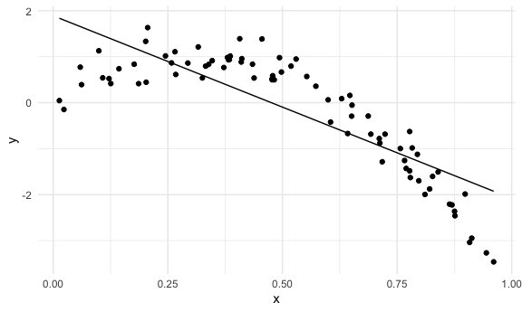
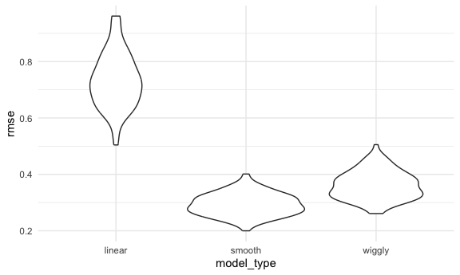

cross validation
================
ASHLEY ROMO
2023-11-18

Load key packages.

``` r
library(tidyverse)
library(modelr)

set.seed(1)
```

## Nonlinear data and CV

``` r
nonlin_df = 
  tibble(
    id = 1:100,
    x = runif(100, 0, 1),
    y = 1 - 10 * (x - .3) ^ 2 + rnorm(100, 0, 0.3)
  )

nonlin_df |> 
  ggplot(aes(x = x, y = y)) + 
  geom_point()
```


Do the train / test split.

``` r
#sample_n(dataset, size #)
train_df = sample_n(nonlin_df, 80)

#anti_join of whatever is in the nonlin_df dataset and not in the train_df and do it by "id"
test_df = anti_join(nonlin_df, train_df, by = "id")
```

``` r
train_df |> 
  ggplot(aes(x = x, y = y)) + 
  geom_point() + 
  geom_point(data = test_df, color = "red")
```


``` r
#black = training data, red = testing data

# the question is can I fit some curve through the black points here and see how well that curve predicts the red points (there is going to be some error)
```

``` r
#fit a linear model 
linear_mod = lm(y ~ x, data = train_df)

# the right way to fit a smooth model using generalized additive models
#mgcv::gam() where y is a smooth term of x and you specific the data 
# s(x) says give me a smooth function of x
smooth_mod = mgcv::gam(y ~ s(x), data = train_df)

#break the smooth_mod by forcing mgcv to do something by setting k = 30 and the smoothing parameter sp = 10e-6
#k=30 means you are going to get 30 individual line segments spread across the domain
#sp = 10e-6 says it is forcing mgcv to do somethin dumb
wiggly_mod = mgcv::gam(y ~ s(x, k = 30), sp = 10e-6, data = train_df)
```

quick visualization of the linear model

``` r
#modelr::add_predictions(model you want to use to add predictions)
#plot output shows this model is not that great
train_df |> 
  modelr::add_predictions(linear_mod) |> 
  ggplot(aes(x = x, y = y)) + 
  geom_point() + 
  geom_line(aes(y = pred))
```



``` r
# this plot shows a smooth curve going right through the middle of the data points
train_df |> 
  modelr::add_predictions(smooth_mod) |> 
  ggplot(aes(x = x, y = y)) + 
  geom_point() + 
  geom_line(aes(y = pred))
```


``` r
#plot output shows the curve broken down
train_df |> 
  modelr::add_predictions(wiggly_mod) |> 
  ggplot(aes(x = x, y = y)) + 
  geom_point() + 
  geom_line(aes(y = pred))
```


RMSEs on training data can be misleading …

``` r
#assessing goodness of fit can be done via RMSE
rmse(linear_mod, train_df)
```

    ## [1] 0.7178747

``` r
rmse(smooth_mod, train_df)
```

    ## [1] 0.2874834

``` r
rmse(wiggly_mod, train_df)
```

    ## [1] 0.2498309

``` r
#from the rmse, the wiggly_mod shows that it is the best fit (lowest rmse); however, this only works for the dataset used to train the model, but it does not mean it is the best for future data
```

RMSE on testing data gives a sense of out-of-sample prediction accuracy!

``` r
rmse(linear_mod, test_df)
```

    ## [1] 0.7052956

``` r
rmse(smooth_mod, test_df)
```

    ## [1] 0.2221774

``` r
rmse(wiggly_mod, test_df)
```

    ## [1] 0.289051

``` r
#using the test data set, the smooth model appears to be better (lowest rmse)
```

## Use modelr for CV

``` r
#this code takes the nonlinear data frame and partitions it into training and testing splits however many times you tell it to. Then, it stores your training dataset and testing dataset into 2 separate columns 
cv_df = 
  nonlin_df |> 
  crossv_mc(n = 100) 

# you can convert a resample into a dataframe using as.tibble()
cv_df = 
  nonlin_df |> 
  crossv_mc(n = 100) |> 
  mutate(
    train = map(train, as_tibble),
    test = map(test, as_tibble)
  )
```

``` r
# a challenge of whats going on in the training and testing data set is that it is not a tibble but a resample
# resample is rather than storing the dataset over and over again, it just keeps track of which rows are in this sample
# it is like it is saving different rows each time but right now it is saving the row numbers that go along with this
# you can convert a resample into a dataset using as.tibble()
cv_df |> pull(train) |> nth(1) |> as_tibble()
```

    ## # A tibble: 79 × 3
    ##       id      x       y
    ##    <int>  <dbl>   <dbl>
    ##  1     1 0.266   1.11  
    ##  2     3 0.573   0.358 
    ##  3     4 0.908  -3.04  
    ##  4     5 0.202   1.33  
    ##  5     6 0.898  -1.99  
    ##  6     7 0.945  -3.27  
    ##  7     8 0.661  -0.615 
    ##  8     9 0.629   0.0878
    ##  9    10 0.0618  0.392 
    ## 10    14 0.384   0.938 
    ## # ℹ 69 more rows

``` r
cv_df |> pull(train) |> nth(2) |> as_tibble()
```

    ## # A tibble: 79 × 3
    ##       id      x       y
    ##    <int>  <dbl>   <dbl>
    ##  1     1 0.266   1.11  
    ##  2     2 0.372   0.764 
    ##  3     4 0.908  -3.04  
    ##  4     5 0.202   1.33  
    ##  5     6 0.898  -1.99  
    ##  6     7 0.945  -3.27  
    ##  7     8 0.661  -0.615 
    ##  8     9 0.629   0.0878
    ##  9    10 0.0618  0.392 
    ## 10    12 0.177   0.836 
    ## # ℹ 69 more rows

``` r
cv_df |> pull(train) |> nth(3) |> as_tibble()
```

    ## # A tibble: 79 × 3
    ##       id     x      y
    ##    <int> <dbl>  <dbl>
    ##  1     1 0.266  1.11 
    ##  2     2 0.372  0.764
    ##  3     3 0.573  0.358
    ##  4     5 0.202  1.33 
    ##  5     6 0.898 -1.99 
    ##  6     8 0.661 -0.615
    ##  7    11 0.206  1.63 
    ##  8    12 0.177  0.836
    ##  9    13 0.687 -0.291
    ## 10    14 0.384  0.938
    ## # ℹ 69 more rows

Apply each model to all training datasets, and evaluate on all testing
datasets.

``` r
# fit a linear model to all training dataset so it it will be a mutate where a linear fit is mapping across all training dataset using a linear model where y against x using that dataset

#map2_dbl() simplifies the output to just a number since we know the output will just be one number
cv_results =
  cv_df |> 
  mutate(
    linear_fit = map(train, \(df) lm(y ~ x, data = df)),
    smooth_fit = map(train, \(df) mgcv::gam(y ~ s(x), data = df)),
    wiggly_fit = map(train, \(df) mgcv::gam(y ~ s(x, k = 30), sp = 10e-6, data = df))
  ) |> 
  mutate(
    rmse_linear = map2_dbl(linear_fit, test, \(mod, df) rmse(mod, df)),
    rmse_smooth = map2_dbl(smooth_fit, test, \(mod, df) rmse(mod, df)),
    rmse_wiggly = map2_dbl(wiggly_fit, test, \(mod, df) rmse(mod, df))
  )
```

``` r
cv_results |> 
  select(starts_with("rmse")) |> 
  pivot_longer(
    everything(),
    names_to = "model_type",
    values_to = "rmse",
    names_prefix = "rmse_"
  ) |> 
  group_by(model_type) |> 
  summarize(m_rmse = mean(rmse))
```

    ## # A tibble: 3 × 2
    ##   model_type m_rmse
    ##   <chr>       <dbl>
    ## 1 linear      0.733
    ## 2 smooth      0.293
    ## 3 wiggly      0.362

``` r
cv_results |> 
  select(starts_with("rmse")) |> 
  pivot_longer(
    everything(),
    names_to = "model_type",
    values_to = "rmse",
    names_prefix = "rmse_"
  ) |> 
  ggplot(aes(x = model_type, y = rmse)) +
  geom_violin()
```


