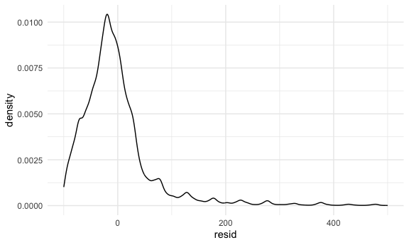
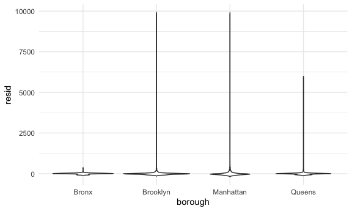
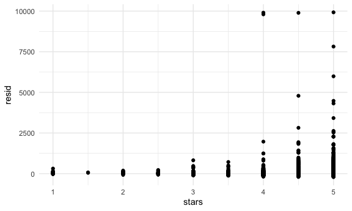
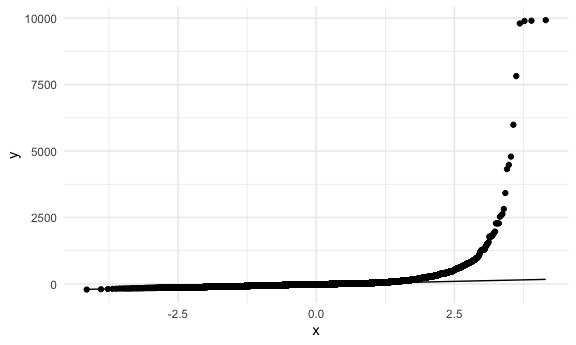

linear models
================
ASHLEY ROMO
2023-11-18

Load key packages.

``` r
library(tidyverse)
library(p8105.datasets)
```

## Load and clean the Airbnb data

``` r
data("nyc_airbnb")

nyc_airbnb = 
  nyc_airbnb |> 
  mutate(stars = review_scores_location / 2) |> 
  select(
    price, stars, borough = neighbourhood_group, 
    neighbourhood, room_type) |> 
  filter(borough != "Staten Island")
```

Let’s fit a model!!

``` r
# lm(price ~ stars + borough, date = nyc_airbnb)
fit = 
  nyc_airbnb |> 
  lm(price ~ stars + borough, data = _) #underscore here specifies the dataset
```

Let’s look at the `fit`

``` r
fit # not very helpful
```

    ## 
    ## Call:
    ## lm(formula = price ~ stars + borough, data = nyc_airbnb)
    ## 
    ## Coefficients:
    ##      (Intercept)             stars   boroughBrooklyn  boroughManhattan  
    ##           -70.41             31.99             40.50             90.25  
    ##    boroughQueens  
    ##            13.21

``` r
summary(fit) #provides residuals info and coefficient info (estimate, sd error, t value, and p value)
```

    ## 
    ## Call:
    ## lm(formula = price ~ stars + borough, data = nyc_airbnb)
    ## 
    ## Residuals:
    ##    Min     1Q Median     3Q    Max 
    ## -169.8  -64.0  -29.0   20.2 9870.0 
    ## 
    ## Coefficients:
    ##                  Estimate Std. Error t value Pr(>|t|)    
    ## (Intercept)       -70.414     14.021  -5.022 5.14e-07 ***
    ## stars              31.990      2.527  12.657  < 2e-16 ***
    ## boroughBrooklyn    40.500      8.559   4.732 2.23e-06 ***
    ## boroughManhattan   90.254      8.567  10.534  < 2e-16 ***
    ## boroughQueens      13.206      9.065   1.457    0.145    
    ## ---
    ## Signif. codes:  0 '***' 0.001 '**' 0.01 '*' 0.05 '.' 0.1 ' ' 1
    ## 
    ## Residual standard error: 181.5 on 30525 degrees of freedom
    ##   (9962 observations deleted due to missingness)
    ## Multiple R-squared:  0.03423,    Adjusted R-squared:  0.03411 
    ## F-statistic: 270.5 on 4 and 30525 DF,  p-value: < 2.2e-16

``` r
summary(fit)$coef #take out the coefficient table 
```

    ##                   Estimate Std. Error   t value     Pr(>|t|)
    ## (Intercept)      -70.41446  14.020697 -5.022180 5.137589e-07
    ## stars             31.98989   2.527500 12.656733 1.269392e-36
    ## boroughBrooklyn   40.50030   8.558724  4.732049 2.232595e-06
    ## boroughManhattan  90.25393   8.567490 10.534465 6.638618e-26
    ## boroughQueens     13.20617   9.064879  1.456850 1.451682e-01

``` r
coef(fit) # take out value of coefficients alone
```

    ##      (Intercept)            stars  boroughBrooklyn boroughManhattan 
    ##        -70.41446         31.98989         40.50030         90.25393 
    ##    boroughQueens 
    ##         13.20617

``` r
# fitted.values(fit) #take out all of the fitted values
```

tidy up the output instead

``` r
#better way to do this is using glance()

#glance() extracts general model fits statistics aka high level summary of how well the model works, including R^2, adjusted R^2, overal gloval p value, etc

fit |> 
  broom::glance()
```

    ## # A tibble: 1 × 12
    ##   r.squared adj.r.squared sigma statistic   p.value    df   logLik    AIC    BIC
    ##       <dbl>         <dbl> <dbl>     <dbl>     <dbl> <dbl>    <dbl>  <dbl>  <dbl>
    ## 1    0.0342        0.0341  182.      271. 6.73e-229     4 -202113. 4.04e5 4.04e5
    ## # ℹ 3 more variables: deviance <dbl>, df.residual <int>, nobs <int>

tidy up the coefficients

``` r
#use the tidy() function pulls out the coefficient table

#tidy() is a tibble (better than glance because glance outputs a matrix)

fit |> 
  broom::tidy() |> 
  mutate(term = str_replace(term, "^borough", "Borough: ")) |> 
  select(term, estimate, p.value) |> 
  knitr::kable(digits = 3)
```

| term               | estimate | p.value |
|:-------------------|---------:|--------:|
| (Intercept)        |  -70.414 |   0.000 |
| stars              |   31.990 |   0.000 |
| Borough: Brooklyn  |   40.500 |   0.000 |
| Borough: Manhattan |   90.254 |   0.000 |
| Borough: Queens    |   13.206 |   0.145 |

## Fit another model

``` r
fit = 
  nyc_airbnb |>
lm(price ~ stars + borough + room_type, data = _)
# when R is creating these indicator variables, it is taking the variable you started out with and assuming there is a factor ordering in alphabetical order
#here bronx is the reference category because it is the first alphabetically, but you can specificy the order


fit = 
  nyc_airbnb |> 
  mutate(
    borough = fct_infreq(borough), #factor based on frequency, so reference category changes. Now, reference is Manhattan
    room_type = fct_infreq(room_type)
  ) |> 
  lm(price ~ stars + borough + room_type, data = _)

fit |> 
  broom::tidy()
```

    ## # A tibble: 7 × 5
    ##   term                  estimate std.error statistic  p.value
    ##   <chr>                    <dbl>     <dbl>     <dbl>    <dbl>
    ## 1 (Intercept)              113.      11.8       9.54 1.56e-21
    ## 2 stars                     21.9      2.43      9.01 2.09e-19
    ## 3 boroughBrooklyn          -40.3      2.15    -18.8  4.62e-78
    ## 4 boroughQueens            -55.5      3.59    -15.4  1.32e-53
    ## 5 boroughBronx             -63.0      8.22     -7.67 1.76e-14
    ## 6 room_typePrivate room   -105.       2.05    -51.2  0       
    ## 7 room_typeShared room    -129.       6.15    -21.0  2.24e-97

## Quick look at diagnostics (minute 32)

``` r
#regression diagnostics boils down to get the residuals and do a careful inspection of residuals to make sure you don't have overly skewed distributions and non-normal distributions
#make sure you have the residuals you meed by using add_residuals(dataframe,added residuals form the model you just fit) function
#output gives us a residual column that shows what happens after you fit this model (here, it is the model = fit) and apply it to this dataset (Data = nyc_airbnb) to compute the residuals that go along with the data

#you can also use this function to check if your model is generalizable  
nyc_airbnb |> 
  modelr::add_residuals(fit) |> 
  ggplot(aes(x = resid)) + #helpful first look
  geom_density() +
  xlim(-100, 500)
```



``` r
nyc_airbnb |> 
  modelr::add_residuals(fit) |> 
  ggplot(aes(x = borough, y = resid)) +  #can plot your residuals
  geom_violin() 
```



``` r
nyc_airbnb |> 
  modelr::add_residuals(fit) |> 
  ggplot(aes(x = stars, y = resid)) + 
  geom_point() 
```



``` r
##always need to check residuals to make sure we are not violating the assumption 
```

Now with a qq plot!

``` r
nyc_airbnb |> 
  modelr::add_residuals(fit) |> 
  ggplot(aes(sample = resid)) + 
  stat_qq() + 
  stat_qq_line()
```



## Hypothesis test for categorical predictor

fit a “null” and “alternative” model

``` r
fit |> 
  broom::tidy() #this gives the p values for each variable to see if it is significant
```

    ## # A tibble: 7 × 5
    ##   term                  estimate std.error statistic  p.value
    ##   <chr>                    <dbl>     <dbl>     <dbl>    <dbl>
    ## 1 (Intercept)              113.      11.8       9.54 1.56e-21
    ## 2 stars                     21.9      2.43      9.01 2.09e-19
    ## 3 boroughBrooklyn          -40.3      2.15    -18.8  4.62e-78
    ## 4 boroughQueens            -55.5      3.59    -15.4  1.32e-53
    ## 5 boroughBronx             -63.0      8.22     -7.67 1.76e-14
    ## 6 room_typePrivate room   -105.       2.05    -51.2  0       
    ## 7 room_typeShared room    -129.       6.15    -21.0  2.24e-97

``` r
#if you wanted to ask if you need room type (yes vs no), you need to compare a model with the categorical predictor and one without 
fit_null = lm(price ~ stars + borough, data = nyc_airbnb) #linear model of price on stars and borough using nyc_airbnb model
fit_alternative = lm(price ~ stars + borough + room_type, data = nyc_airbnb)
#alternative is the null plus room type  (we want to know if room type is significant)

#can also use the ANOVA 
anova(fit_null, fit_alternative) |> 
  broom::tidy() 
```

    ## # A tibble: 2 × 7
    ##   term                        df.residual    rss    df   sumsq statistic p.value
    ##   <chr>                             <dbl>  <dbl> <dbl>   <dbl>     <dbl>   <dbl>
    ## 1 price ~ stars + borough           30525 1.01e9    NA NA            NA       NA
    ## 2 price ~ stars + borough + …       30523 9.21e8     2  8.42e7     1394.       0
